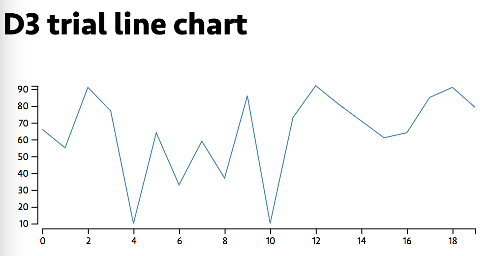

# d3-trial-line


[![NPM Version][npm-image]][npm-url]
[![NPM Downloads][downloads-image]][downloads-url]

D3 line chart.


## Installation

```
npm install d3-trial-line
```

## Development

```
npm start
```

## Preview



### LICENSE

[MIT](LICENSE) &copy; [GeekPlux](https://github.com/geekplux)


---

> Blog [geekplux.com](http://geekplux.com) &nbsp;&middot;&nbsp;
> GitHub [@geekplux](https://github.com/geekplux) &nbsp;&middot;&nbsp;
> Twitter [@geekplux](https://twitter.com/geekplux)


[npm-image]: https://img.shields.io/npm/v/d3-trial-line.svg?style=flat-square
[npm-url]: https://npmjs.org/package/d3-trial-line
[downloads-image]: https://img.shields.io/npm/dm/d3-trial-line.svg?style=flat-square
[downloads-url]: https://npmjs.org/package/d3-trial-line
